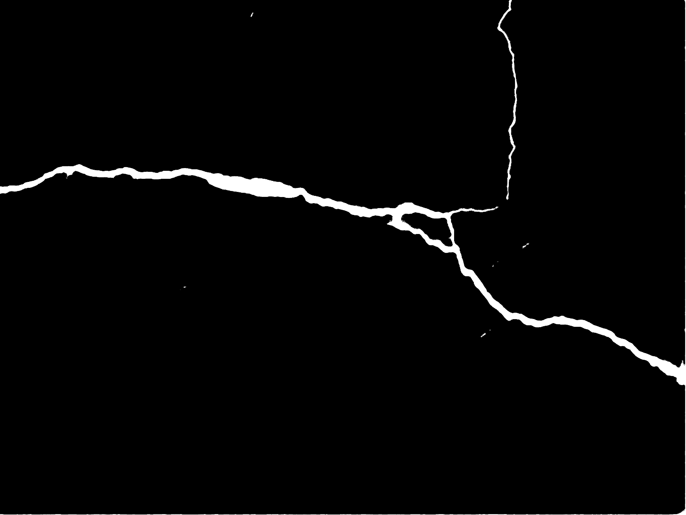

<h2>TensorFlow-FlexUNet-Tiled-Image-Segmentation-Concrete-Crack (2025/10/23)</h2>
<!--
Toshiyuki Arai 
Software Laboratory antillia.com 
 -->
This is the first experiment of Image Segmentation for <b>Concrete-Crack </b> based on 
our <a href="./src/TensorFlowFlexUNet.py">TensorFlowFlexUNet</a>
 (<b>TensorFlow Flexible UNet Image Segmentation Model for Multiclass</b>)
, and a 512x512 pixels dataset <a href="https://drive.google.com/file/d/1TK6Fk0CvUOTijwRr6zOV_Z-i3hNJDZB-/view?usp=sharing">
Tiled-Concrete-Crack-ImageMask-Dataset.zip</a> 
 which was derived by us from Mendeley Data  
<a href="https://data.mendeley.com/datasets/jwsn7tfbrp/1">
<b>Concrete Crack Segmentation Dataset</b>
</a>
 
 
<!--
As demonstrated in <a href="https://github.com/sarah-antillia/TensorFlow-FlexUNet-Image-Segmentation-STARE-Retinal-Vessel">
TensorFlow-FlexUNet-Image-Segmentation-STARE-Retinal-Vessel</a>,
 our Multiclass TensorFlowFlexUNet, which uses categorized masks, can also be applied to 
single-class image segmentation models. 
This is because it inherently treats the background as one category and your single-class mask data as 
a second category. In essence, your single-class segmentation model will operate with two categorized classes within our Multiclass UNet framework.
  
-->
<b>Divide-and-Conquer Strategy</b> 
Since the pixel size of images and masks of the original dataset is very large 4K or 3K,
we adopted the following <b>Divide-and-Conquer Strategy</b> for building the segmentation model.
 
 
<b>1.Tiled Image and Mask Dataset</b> 
We generated a master PNG images and masks dataset of 4032x3024 pixels from the original mask (BW) JPG files and 
image (rgb) JPG files, and then generated the <b>Tiled-Concrete-Crack-ImageMask-Dataset</b>, 
which was a tiledly-splitted image and mask of 512x512 pixels dataset, from the master dataset
 
 
<b>2. Train Model by Tiled ImageMask Dataset</b> 
We trained and validated the TensorFlowFlexUNet model by using the Tiled-Concrete-Crack ImageMask Dataset,
 
 
<b>3. Tiled Image Segmentation</b> 
We applied our Tiled-Image Segmentation Inference method to predict crack regionns for the mini_test images of the original 
high resolution .  
For a typical example of the Tiled-Image-Segmentation, 
please see also <a href="https://github.com/sarah-antillia/TensorFlow-FlexUNet-Tiled-Image-Segmentation-IDRiD">TensorFlow-FlexUNet-Tiled-Image-Segmentation-IDRiD</a>
 
 

<b>Actual Image Segmentation for Images of 4032x3024 pixels</b> 
As shown below, the inferred masks predicted by our segmentation model trained on the 
PNG dataset appear similar to the ground truth masks, but they lack precision in certain areas. 
However, the second and third masks (ground_truths) seem to be slightly incorrect.
 
<table>
<tr>
<th>Input: image</th>
<th>Mask (ground_truth)</th>
<th>Prediction: tiled_inferred_mask</th>
</tr>
<tr>
<td></td>
<td></td>
<td></td>
</tr>
</tr>
<td></td>
<td></td>
<td></td>
</tr>
<tr>
<td></td>
<td></td>
<td></td>
</tr>
</table>

 
 
<h3>1 Dataset Citation</h3>
The dataset used here was obtained from 
  
<a href="https://data.mendeley.com/datasets/jwsn7tfbrp/1">
<b>Concrete Crack Segmentation Dataset</b>
</a>
</b>
  
<b>Contributor:</b> 
Çağlar Fırat Özgenel
 
 
<b>Description</b> 
The dataset includes 458 hi-res images together with their alpha maps (BW) indicating the crack presence. 
The ground truth for semantic segmentation has two classes to conduct binary pixelwise classification. 
The photos are captured in various buildings located in Middle East Technical University. 
 
You can access a larger dataset containing images with 227x227 px dimensions for classification 
which are produced from this dataset from  http://dx.doi.org/10.17632/5y9wdsg2zt.1 . 
 
 
<b>LICENSE</b> 
<a href="https://interoperable-europe.ec.europa.eu/licence/creative-commons-attribution-40-international-cc-40">CC BY 4.0</a>
 
 
<h3>
2 Concrete-Crack ImageMask Dataset
</h3>
 If you would like to train this Concrete-Crack Segmentation model by yourself,
 please download the 512x512 pixels PNG <a href="https://drive.google.com/file/d/1TK6Fk0CvUOTijwRr6zOV_Z-i3hNJDZB-/view?usp=sharing">
 Tiled-Concrete-Crack-ImageMask-Dataset.zip
 </a> on the google drive, expand the downloaded, and put it under dataset folder to be:
<pre>
./dataset
└─Concrete-Crack
    ├─test
    │   ├─images
    │   └─masks
    ├─train
    │   ├─images
    │   └─masks
    └─valid
        ├─images
        └─masks
</pre>
<b>Concrete-Crack Statistics</b> 
 
 
As shown above, the number of images of train and valid datasets is large enough to use for a training set of our segmentation model.
  

<b>Train_images_sample</b> 

 
<b>Train_masks_sample</b> 

 
 
<h3>
3 Train TensorFlowUNet Model
</h3>
 We trained Concrete-Crack TensorFlowFlexUNet Model by using the following
<a href="./projects/TensorFlowFlexUNet/Tiled-Concrete-Crack/train_eval_infer.config"> <b>train_eval_infer.config</b></a> file.  
Please move to ./projects/TensorFlowFlexUNet/Tiled-Concrete-Crack and, and run the following bat file. 
<pre>
>1.train.bat
</pre>
, which simply runs the following command. 
<pre>
>python ../../../src/TensorFlowFlexUNetTrainer.py ./train_eval_infer.config
</pre>

<b>Model parameters</b> 
Defined a small <b>base_filters = 16</b> and large <b>base_kernels = (9,9)</b> for the first Conv Layer of Encoder Block of 
<a href="./src/TensorFlowFlexUNet.py">TensorFlowFlexUNet.py</a> 
and a large num_layers (including a bridge between Encoder and Decoder Blocks).
<pre>
[model]
image_width    = 512
image_height   = 512
image_channels = 3

num_classes    = 2

base_filters   = 16
base_kernels   = (9,9)
num_layers     = 8
dropout_rate   = 0.05
dilation       = (1,1)

</pre>

<b>Learning rate</b> 
Defined a very small learning rate.  
<pre>
[model]
learning_rate  = 0.00007
</pre>

<b>Online augmentation</b> 
Disabled our online augmentation.  
<pre>
[model]
model         = "TensorFlowFlexUNet"
generator     = False
</pre>

<b>Loss and metrics functions</b> 
Specified "categorical_crossentropy" and <a href="./src/dice_coef_multiclass.py">"dice_coef_multiclass"</a>. 
You may specify other loss and metrics function names. 
<pre>
[model]
loss           = "categorical_crossentropy"
metrics        = ["dice_coef_multiclass"]
</pre>
<b>Learning rate reducer callback</b> 
Enabled learing_rate_reducer callback, and a small reducer_patience.
<pre> 
[train]
learning_rate_reducer = True
reducer_factor     = 0.5
reducer_patience   = 4
</pre>
<b>Early stopping callback</b> 
Enabled early stopping callback with patience parameter.
<pre>
[train]
patience      = 10
</pre>
<b>Tiled Inference</b>
<pre>
[tiledinfer] 
overlapping   = 128
images_dir    = "./mini_test/images/"
output_dir    = "
</pre>
<b>RGB Color map</b> 
rgb color map dict for Concrete-Crack 1+1 classes.
<pre>
[mask]
mask_datatype    = "categorized"
mask_file_format = ".png"
;                    crack:white
rgb_map = {(0,0,0):0,(255,255,255):1, }
</pre>

<b>Epoch change tiled inference callback</b> 
Enabled <a href="./src/EpochChangeTiledInferencer.py">epoch_change tiled inferenc callback (EpochChangeTiledInferencer.py)</a></b>. 
<pre>
[train]
epoch_change_tiled_infer     = True
epoch_change_tiled_infer_dir =  "./epoch_change_tiled_infer"
num_infer_images         = 6
</pre>

By using this callback, on every epoch_change, the tiled inference callback can be called
 for 6 images in <b>mini_test</b> folder. This will help you confirm how the predicted mask changes 
 at each epoch during your training process.    

<b>Epoch_change_inference output at starting (epoch 1,2,3)</b> 
 
 
<b>Epoch_change_inference output at middlepoint (epoch 20,22,21)</b> 
 
 

<b>Epoch_change_inference output at ending (epoch 40,41,42)</b> 
 
 

In this experiment, the training process was stopped at epoch 42 by EarlyStopping Callback.  
 
 

<a href="./projects/TensorFlowFlexUNet/Tiled-Concrete-Crack/eval/train_metrics.csv">train_metrics.csv</a> 
 

 
<a href="./projects/TensorFlowFlexUNet/Tiled-Concrete-Crack/eval/train_losses.csv">train_losses.csv</a> 
 

 

<h3>
4 Evaluation
</h3>
Please move to a <b>./projects/TensorFlowFlexUNet/Tiled-Concrete-Crack</b> folder, 
and run the following bat file to evaluate TensorFlowUNet model for Concrete-Crack. 
<pre>
./2.evaluate.bat
</pre>
This bat file simply runs the following command.
<pre>
python ../../../src/TensorFlowFlexUNetEvaluator.py ./train_eval_infer.config
</pre>

Evaluation console output: 

  Image-Segmentation-Concrete-Crack

<a href="./projects/TensorFlowFlexUNet/Tiled-Concrete-Crack/evaluation.csv">evaluation.csv</a> 

The loss (categorical_crossentropy) to this Concrete-Crack/test was not low, but dice_coef_multiclass high as shown below.
 
<pre>
categorical_crossentropy,0.0479
dice_coef_multiclass,0.9822
</pre>
 
<h3>
5 Inference
</h3>
Please move to a <b>./projects/TensorFlowFlexUNet/Tiled-Concrete-Crack</b> folder 
,and run the following bat file to infer segmentation regions for images by the Trained-TensorFlowFlexUNet model for Concrete-Crack. 
<pre>
./4.tiledinfer.bat
</pre>
This simply runs the following command.
<pre>
python ../../../src/TensorFlowFlexUNetTiledInferencer.py ./train_eval_infer.config
</pre>

<b>mini_test_images</b> 
 
<b>mini_test_mask(ground_truth)</b> 
 

<b>Tiled_inferred test masks</b> 
 
 
 

<b>Enlarged images and masks for Images of 4032x3024 pixels </b> 

<table>
<tr>

<th>Image</th>
<th>Mask (ground_truth)</th>
<th>Tiled_inferred_mask</th>
</tr>

<td></td>
<td></td>
<td></td>
</tr>
<tr>
<td></td>
<td></td>
<td></td>
</tr>
<tr>
<td></td>
<td></td>
<td></td>
</tr>
<tr>
<td></td>
<td></td>
<td></td>
</tr>
<tr>
<td></td>
<td></td>
<td></td>
</tr>
<tr>
<td></td>
<td></td>
<td></td>
</tr>

</table>

 

<h3>
References
</h3>
<b>1. TensorFlow-FlexUNet-Image-Segmentation-Model</b> 
Toshiyuki Arai antillia.com  
<a href="https://github.com/sarah-antillia/TensorFlow-FlexUNet-Image-Segmentation-Model">
https://github.com/sarah-antillia/TensorFlow-FlexUNet-Image-Segmentation-Model
</a>
 
 
<b>2. Multi-temporal crack segmentation in concrete structures using deep learning approaches</b> 
Said Harb, Pedro Achanccaray, Mehdi Maboudi, Markus Gerke 
<a href="https://arxiv.org/pdf/2411.04620">https://arxiv.org/pdf/2411.04620</a>
 
 
<b>3. An efficient semantic segmentation method for road crack based on EGA-UNet</b> 
Li Yang, Jingwei Deng, Hailong Duan & Chenchen Yang  
<a href="https://www.nature.com/articles/s41598-025-01983-3">https://www.nature.com/articles/s41598-025-01983-3<</a>
 
 
<b>4. EfficientCrackNet: A Lightweight Model for Crack Segmentation</b> 
Abid Hasan Zim, Aquib Iqbal, Zaid Al-Huda, Asad Malik, Minoru Kuribayash 
<a href="https://arxiv.org/pdf/2409.18099">https://arxiv.org/pdf/2409.18099</a>
 
 
<b>5. Fine-grained crack segmentation for high-resolution images via a multiscale cascaded network</b> 
Honghu Chu, Pang-jo Chun 
<a href="https://onlinelibrary.wiley.com/doi/full/10.1111/mice.13111">https://onlinelibrary.wiley.com/doi/full/10.1111/mice.13111</a>
 
 
<b>5. TensorFlow-FlexUNet-Image-Segmentation-Crack</b> 
Toshiyuki Arai antillia.com  
<a href="https://github.com/atlan-antillia/TensorFlow-FlexUNet-Image-Segmentation-Crack">
https://github.com/atlan-antillia/TensorFlow-FlexUNet-Image-Segmentation-Crack
</a>
 
